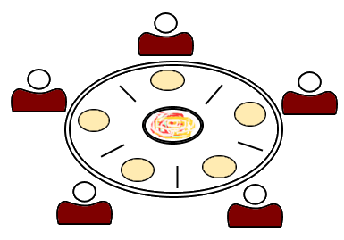
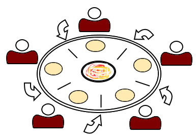
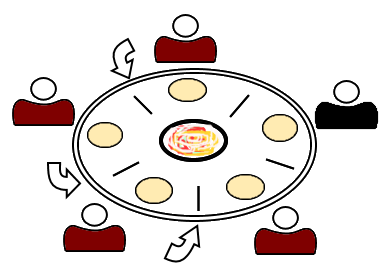

## INTRODUCTION 

In the Multitasking Operating system, multiple processes can be executed simultaneously and it has the ability to preempt the currently running process. In order to execute multiple processes parallelly, OS should provide a mechanism for Inter-Process Communication(IPC). Lack of synchronization in IPC causes problems like Inconsistency, Data loss, Deadlock.

 These synchronization problems really occur because of:
* **Critical Section**: Critical section is that part of the program where shared resources are accessed and the non-critical section is that part of the program which does not access any shared resource. A program may have a series of critical and non-critical sections.
* **Race Condition**: Processes must be racing to access the Critical section and the end result will depend on the order in which the processes finish their updates.
* **Preemption**: Running process will be suspended/preempted and another process will be scheduled on CPU.

**Deadlock - Waiting Forever Problem**:

 Deadlock is a situation where a process is waiting for getting access to a resource that is already allocated to some other process and that another process is waiting for a resource whose access is held by the first process. In this situation both the processes will prevent each other from getting access to the resource they want hence resulting in a deadlock where none of the processes can complete execution.

Consider P1 and P2 are two processes. P1 requests for resource R1 and acquires it, P2 requests for resource R2 and acquires it. For further execution, P1 needs resource R2 for execution, and P2 need resource R1 for execution.

  

In such a situation, both the processes will wait until the resource is set free. They will remain in a wait state forever and hence leading to a deadlock.

To proceed, the operating system won't understand what action to take. The only way is to abort or stop one or more processes that will release the resource, which results in complete the execution of remaining processes releasing all the resources so that the first process can complete its execution.

 **Following are necessary conditions that will hold if there is deadlock**:
  * **Mutual Exclusion**: Resources are non-sharable. At a time only one process can use resources
  * **Hold and Wait**: Process holds at least one resource and waits for a resource held by another process
  * **Non Preemption**: The process does not release the resource
  * **Circular Wait**: A set of processes is waiting for a resource held by each other in circular form

**Following are the strategies of handling deadlock**:
  * **Deadlock Avoidance and prevention**: Do not let the system go in deadlock. [Popular algorithm is Banker's Algorithm]
  * **Detection and Recovery**: Let deadlock occur, then do preemption or abort the processes to handle it if occurred. [Doctor's Algorithm]
  * **Deadlock Ignorance**: If the deadlock is very rare, then let it happen and reboot the system if it occurs. This is the approach used in today's operating systems like Windows and Linux. [Ostrich Algorithm]

**Dining Philosopher's Problem**:
  Dining Philosopher problem is an example that is normally considered when considering about deadlock.
  

  
  

1. Five philosophers sit around a round table with bowls of spaghetti and forks are placed between each pair of adjacent philosophers. 
2. Each philosopher can be in either of two states: Thinking and Eating. 
3. When a philosopher wants to eat, he uses two chopsticks. 
4. When a philosopher wants to think, he keeps down both the chopsticks. 
5. Infinite supply and infinite demand are assumed. 
6. It must be ensured that no philosopher will starve. If all the philosophers want to eat at the same time, due to the unavailability of chopsticks all of them will not be able to eat together and this leads to a situation called 'Deadlock'.  

**Following are the possible cases in Dining philosopher's Problem**:
1. A philosopher is allowed to eat by picking up left chopstick first and then the right chopstick. Ref[5]
  <code>

  void philosopher(void)

  {

        while(true) {

         Thinking();

         take_fork(i);
         take_fork((i+1)%5);

         Eating();

         put_fork(i);
         put_fork((i+1)%5);
       }

  }

  </code>

  The problem with the above solution is that if all five philosophers become hungry at the same time then they pick up their left chopstick first which will make all chopstick value to 0 hence they will wait forever for the right chopstick. If any two philosophers are faster in both eating and thinking, then all the only these two philosophers will occupy forks.

  

  

2. Use of Semaphore: Every philosopher allowed to pick left chopstick first then right except one who is allowed to pick right chopstick first then left and after eating he has to keep the right chopstick first and then right.Ref[5]

<table style="text-align:center;padding:10px;width:650px;">
<tr>
	<th style="text-align:center;width:150px;">Lefty</th>
	<th style="text-align:center">Righty</th>
</tr>
<tr>
  <td style="text-align:justify">
    <code>

    void philosopher(void)

  {

        while(true) {

         Thinking();

         wait(take_fork(Si);
         wait(take_fork(S(i+1)%5));

         Eating();

         signal(put_fork(Si);
         signal(put_fork(S(i+1)%5)));
       }

  }

    </code>
  </td>
  <td style="text-align:justify">
    <code>

      void philosopher(void)

      {

            while(true) {

             Thinking();

             wait(take_fork(S(i+1)%5));
             wait(take_fork(Si);

             Eating();

             signal(put_fork(S(i+1)%5)));
             signal(put_fork(Si);
           }

      }
  </code>
  </td>
</tr>
</table>

By applying the above solution, we can avoid a circular waiting situation which is one of the reasons for the deadlock to occur.
  

  

