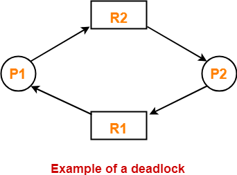

## INTRODUCTION 

 In Multitasking Operating system multiple processes can be executed simultaneously and it has ability to preempt the currently running process. In order to execute multiple processes parallelly, OS should provide mechanism for Inter Process Communication(IPC). Lack of synchronization in IPC causes the problems like Inconsistency, Data loss, Deadlock.

 These synchronization problems really occur because of:
* **Critical Section**: Critical section is that part of the program where shared resources are accessed and non-critical section is that part of the program which does not access any shared resource. Program may have series of critical and non-critical sections.
* **Race Condition**: Processes must be racing to access the Critical section and the end result will depend on the order in which the processes finish their updates.
* **Preemption**: Running process will be suspended/preempted and another process will be scheduled on CPU.

**Deadlock - Waiting Forever Problem**:

 DeadLock is a situation where a process is waiting for getting access to a resource which is already allocated to some other process and that other process is waiting for resource whose access is held by first process. At this situation both the processes will prevent each other from getting access to the resource they want hence resulting in a deadlock where none of the process can complete execution.

Consider P1 and P2 are two processes. P1 requests for resource R1 and acquires it, P2 request for resource R2 and acquires it.
For further execution P1 need resource R2 for execution and P2 need resource R1 for execution.

  

At such a situation, both the processes will wait until resource is set free. They will remain in wait state for ever and hence leading to a deadlock.

To proceed, operating system won't understand what action to take. Only way is to abort or stop one or more processes which will release the resource, which results in complete the execution of remaining processes releasing all the resources so that the first process can complete its execution.

 **Following are necessary conditions that will hold if there is deadlock**:
  * **Mutual Exclusion**: Resources are non-sharable. At a time only one process can use resource.
  * **Hold and Wait**: Process holds a at least one resource and waits for a resource held by another process.
  * **Non Preemption**: Process does not release the resource.
  * **Circular Wait**: A set of processes are waiting for a resource held by each other in circular form.

**Following are the strategies of handling deadlock**:
  * **Deadlock Avoidance and prevention**: Do not let the system go in deadlock. [Popular algo is Banker's Algo.]
  * **Detection and Recovery**: Let deadlock occur, then do preemption or abort the processes to handle it if occurred. [Doctor's Algorithm]
  * **Deadlock Ignorance**: If deadlock is very rare, then let it happen and reboot the system if it occurs. This is the approach used in today's operating systems like Windows and Linux. [Ostrich Algorithm].
