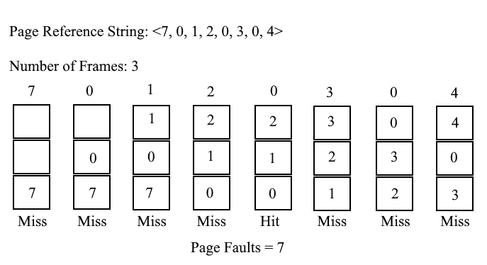
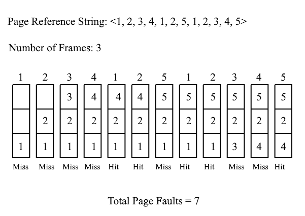
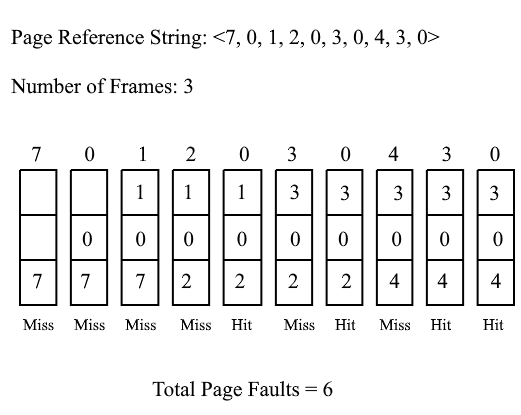

INTRODUCTION

 The operating system which uses demand paging for memory management has reserved memory space in secondary storage called virtual memory.

The main memory is smaller than the virtual memory. This virtual memory acts as the main memory and allows the system to run a program with a bigger size than the size of the main memory.

Page Fault: Page fault happens when the running process accesses a page that is not present in the main memory but present in the virtual memory. In this case, the page must be swapped in from virtual memory to main memory. Swapping in pages is very expensive as it requires disk access, so we'd like to avoid page faults as much as possible.

In an operating system that uses paging for memory management, a page replacement algorithm is needed to decide which page needs to be replaced (swap out) when a new page comes in (swap in). Different page replacement algorithms suggest different ways to decide which page to replace. The goal of all algorithms is to reduce the number of page faults.

Page reference string: Set of successively unique pages referred by processes in the given list of virtual address space
Frame: In paging systems, the main memory is divided into equal size blocks called frames. Page size and frame size are always equal and one page is stored in one frame. So Page in the main memory is referred to as a frame.

Page Replacement Algorithms:
Following are the well-known page replacement algorithms:
  * First In First Out (FIFO)
  * Optimal Page Replacement
  * Least Recently Used (LRU)

**First In First Out (FIFO)**:

  * In this algorithm operating system keeps track of all pages in main memory in a queue.
  * Oldest page in main memory is selected for replacement.
  * The oldest page is at the front of the queue and new page is at the rear of a queue.
  * When a page needs to be replaced, page in the front of the queue is selected for removal.
  * Example shown below with Page reference string: [7, 0, 1, 2, 0, 3, 0, 4] and Number of frames available: 3

  

    
  

  Solution:

  1. Initially all slots are empty, so when 7,0,1 came they are allocated to empty slots (causes 3 page faults). So our queue will be <7,0,1>
  2. When request for page 2 comes, it is not available in memory so it replaces the oldest page i.e 7 (1 page fault). Queue: <0,1,2>
  3. When 0 comes, it is already in the memory so no page fault,
  4. When 3 comes, 0 will be replaced (1 page fault). Queue becomes: <1,2,3>
  5. When next 0 comes, 1 will replaced with 0 ( 1 page fault). Queue becomes: <2,3,0>
  6. Finally when 4 arrives, 2 will be replaced (1 page fault). Queue becomes: <3,0,4>
  Total page faults: 7 page faults

Belady's anomaly :In general with the increase in the number of page frames, the page fault rate should logically decrease. Sometimes for few reference strings with increase in number of frames results increase in page fault rate. This phenomena is known as Belady's anomaly. FIFO and FIFO based replacement techniques suffer from Belady's anomaly.
ex. reference string : [1,2,3,4,1,2,5,1,2,3,4,5]
For this example if number of frames are 3 then total page faults will be 9 and if number of frames are 4 then total page faults will be 10

**Optimal Page Replacement**:
* Choose the page for replacement which will not be used for the longest duration of time in future reference.
* Example shown below with  Page reference string: [1, 2, 3, 4, 1, 2, 5, 1, 2, 3, 4, 5] and Number of frames available: 3

    
  

Solution:

* Initially all frames will be empty so first 3 pages [1,2,3] are allocated to those empty frames and this will cause 3 page faults. So Frame allocation will be : [1,2,3]
* When 4 came it will take place of 3 because 3 will not be used for longest duration in future whereas 1 and 2 will be used before 3. Frame allocation after replacement: [1,2,4]
* When 1 and 2 comes, they are already present in the memory so they will not cause page fault.
* When 5 comes, it will cause page fault and 5 will replace 4. So Frame allocation after replacement: [1,2,5]. Again 1 and 2 comes but they will not cause any page fault.
* When 3 comes, it will cause page fault and can replace either 1 or 2 as both of them will not be used in future but cannot replace 5 as 5 will be used in future. So frame allocation after replacement: [3,2,5].
* When 4 comes, it can replace either 3 or 2 as they will not be used in future. So frame allocation after replacement: [4,2,5]
* Finally when 5 comes no page fault occurs as 5 is already present in the memory.
* Optimal page replacement algorithm gives minimum page faults but it cannot be implemented practically as operating system cannot know future request.
* This algorithm is used as benchmark to measure the performance of other page replacement algorithms.

**Least Recently Used**:
* In this algorithm, page which is recently used is replaced.
* Example shown below with Page reference string: [7, 0, 1, 2, 0, 3, 0, 4, 3, 0] and Number of frames available:  3

    
  

Solution:

* Initially we have all frames empty so when 7 0 1 are allocated to the empty frames they will causes 3 Page faults. So LRU stack: (7,0,1)
* When request for page 2 comes, it is not present in memory so causes page fault and we replace page 7 with page 2 as page 7 is least recently used page. So LRU stack: (0,1,2).
* When request for page 0 comes, it will not cause page fault as page 0 is present in the memory. So LRU stack: (1,2,0).
* When request for page 3 comes page fault will happen and it will take place of page 1. So LRU stack will be (2,0,3)
* 0 is already in memory so no page fault. LRU stack: (2,3,0)
* When 4 comes page fault will happen and it will replace page 2. LRU stack: (3,0,4)
* Now for the further page reference string no page fault because they are already available in the memory.
